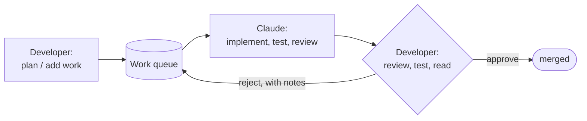

# Playbook

Playbook is a semi-autonomous AI development process centered around human planning and review. The human does the planning, the AI does the work (many tasks in parallel, implementation, testing, docs updates, etc), the human does review and testing.

This repo describes the development process and has skills that the human uses to drive development forward.

## The loop at a glance

The developer plans the work, Claude builds and self-reviews it, the developer review and approves or rejects.



## Prerequisites

[`git`](https://git-scm.com/downloads) **(>= 2.48**, for native relative-path worktrees; the worktree tooling refuses older git**)**, [`bun`](https://bun.sh/docs/installation), and [Claude Code](https://docs.claude.com/en/docs/claude-code/setup), installed on whichever machine runs Claude Code. `scripts/install-prereqs.sh` installs all three (including the latest git) on a fresh Ubuntu machine or VM.

To run the process in a sandbox VM instead (recommended, and required for unattended `/pb:next` runs), two scripts do the whole setup: `bash scripts/setup-host.sh` once per machine (Multipass, NFS, IP forwarding), then `bash scripts/vm.sh` every session (creates or starts the VM, shares this repo into it over NFS, and opens a shell in it). Both are **only tested on Ubuntu**, hosting an Ubuntu VM. See [Host + VM](handbook.md#host--vm).

## Quickstart

Try it out on your development machine:

1. Clone the repo:
```bash
git clone https://github.com/ashleydavis/playbook.git
```
2. Change directory into the repo:
```bash
cd playbook
```
2. Launch Claude Code from the playbook repo root.
3. Run `/pb:bootstrap:new` (greenfield project) or `/pb:bootstrap:existing` (existing project) to scaffold the project into `project/` and the state into `state/`.
4. Run `/pb:status` (or `/pb:help` if you're new). It summarises where things stand and recommends what to run next; each skill points you to the following step from there.

> **Permissions warning.** The committed `.claude/settings.json` sets `bypassPermissions`, so Claude Code runs with permission prompts **off** wherever the playbook repo is launched, including your own host. Run it inside a sandbox VM (see [Host + VM](handbook.md#host--vm)) so the blast radius is the VM, not your machine.

> **Your remotes are your responsibility.** Bootstrap scaffolds `project/` and `state/` as local git repos only. It does not create GitHub repos or push for you. Create a remote for each (the state repo too) and push periodically; Playbook won't do that for you. See [Moving to a new machine](#moving-to-a-new-machine) for what that costs you if you skip it.

## Moving to a new machine

Bootstrap runs once per project, ever. Setting the same project up again on a second machine is three clones, not a bootstrap: **do not** run `/pb:bootstrap:existing` again, it scaffolds over work you already have.

The playbook gitignores `project/` and `state/`, so cloning the playbook brings neither. Each has to be cloned into place itself, which means each needs a remote. If the state repo has no remote yet, give it one from the old machine first (once, ever):

```bash
gh repo create karse-state --private --source=state --remote=origin
git -C state push -u origin main
```

Then on the new machine, a worked example for the `karse` project (substitute your own repo names):

```bash
# 1. Clone the playbook, one clone per project.
git clone https://github.com/ashleydavis/playbook.git playbook-karse
cd playbook-karse

# 2. Prerequisites: git >= 2.48, bun, Claude Code.
#    On a fresh Ubuntu machine this installs all three; skip it if you have them.
bash scripts/install-prereqs.sh

# 3. The project repo goes at project/, the state repo at state/.
#    The directory names matter: the skills and scripts look for exactly these.
git clone git@github.com:ashleydavis/karse.git project
git clone git@github.com:ashleydavis/karse-state.git state

# 4. Whatever the project itself needs to build, test and run.
#    For karse that is its pinned toolchain and its dependencies:
(cd project && mise trust && mise install && bun install)

# 5. Launch Claude Code from the playbook repo root (playbook-karse/), then:
#      /pb:status
```

Before you move, know what does not travel:

- **Unmerged ticket work.** Ticket branches and their worktrees under `project/worktrees/` are local to the machine that ran `/pb:next`, and nothing in the process pushes them. Drain the queues to `done/` first, or run `/pb:reset` to requeue and discard them; anything left in `in-progress/`, `agent-review/` or `human-review/` arrives on the new machine as a ticket whose branch does not exist.
- **Merges.** `/pb:next` merges approved tickets into the local `main` of `project/` and does not push. Push `project/` before you move, or the new clone is behind.
- **Gitignored files.** Local Claude Code settings, build output, caches, logs. Recreate them on the new machine.

Both machines can now stay in step, because both clone from the same three remotes. The state repo is the one people forget: the queues, the review history and every screenshot of captured evidence live there and nowhere else, so an unpushed state repo means one disk failure loses the record of everything the process has done.

## Next steps

- [Handbook](handbook.md#setup): read the Playbook handbook.
- [Setup](handbook.md#setup): the detailed setup steps.
- [Project bootstrap](handbook.md#project-bootstrap): the detailed bootstrap steps.
- [Host + VM](handbook.md#host--vm): a more autonomous, VM-based setup.

## Layout

```bash
playbook/
  CLAUDE.md   # Standing instructions, loaded when Claude Code launches from here.
  README.md
  handbook.md # The handbook. The full process written for humans.
  docs/
    process.md        # Concise process for the AI.
    output-format.md  # How skills present output.
    ticket-selection.md  # Shared ticket selection menu.
  index.md    # Orientation. What lives where.
  .claude/             # Claude Code config for the playbook repo.
    settings.json      # Permissions off (bypassPermissions).
    commands/
      pb/              # The pb:* skills.
        help.md        # Get help!
        status.md
        plan/
          break.md   # Break a written plan into tickets.
        docs.md
        add.md
        next.md
        review.md
        debug.md
        customize.md   # Interview the developer and tune the project's enforced rules.
        bootstrap/
          new.md       # Bootstrap a new project.
          existing.md  # Bootstrap an existing project.
  templates/           # Templates for new projects and various files.
    project/
    state/
    feature-template/
    ticket-template/
    commit-template/   # Commit message template.
  scripts/
    install-prereqs.sh # Installs git, bun, and Claude Code.
    move.ts            # Moves tickets between queues.
  project/    # The project repo (created by bootstrap, gitignored).
  state/      # The state repo (created by bootstrap, gitignored).
```

## How it fits with project and state repos
Each project has two further repos, nested in the playbook repo root:
- **Project repo**: the product you are building at `project/`, its code, and any docs and rules it keeps. Source of truth for the project.
- **State repo**: at `state/`, tracks the state of the project: the ticket queues (`state/tickets/`).

Bootstrap (`pb:bootstrap:new` / `pb:bootstrap:existing`) scaffolds both from [templates/](templates/). The project repo is decoupled from the playbook which remains separate and shareable between multiple projects.

## Further reading
- [handbook.md](handbook.md): the full process description, written for humans.
- [docs/process.md](docs/process.md): the concise version Claude reads at session start.
- [index.md](index.md): a compact map of what lives where across all three repos.
- [templates/commit-template/commit-template.txt](templates/commit-template/commit-template.txt): the commit message format. Customize it to suit your projects.
