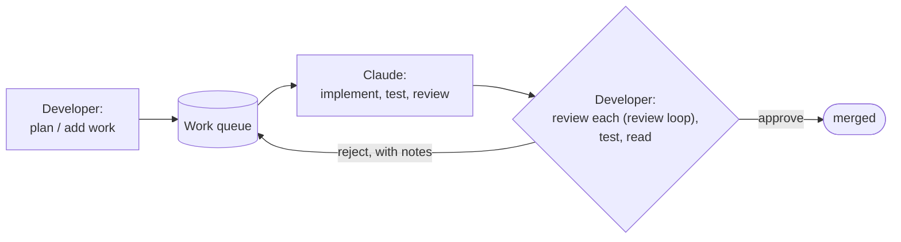
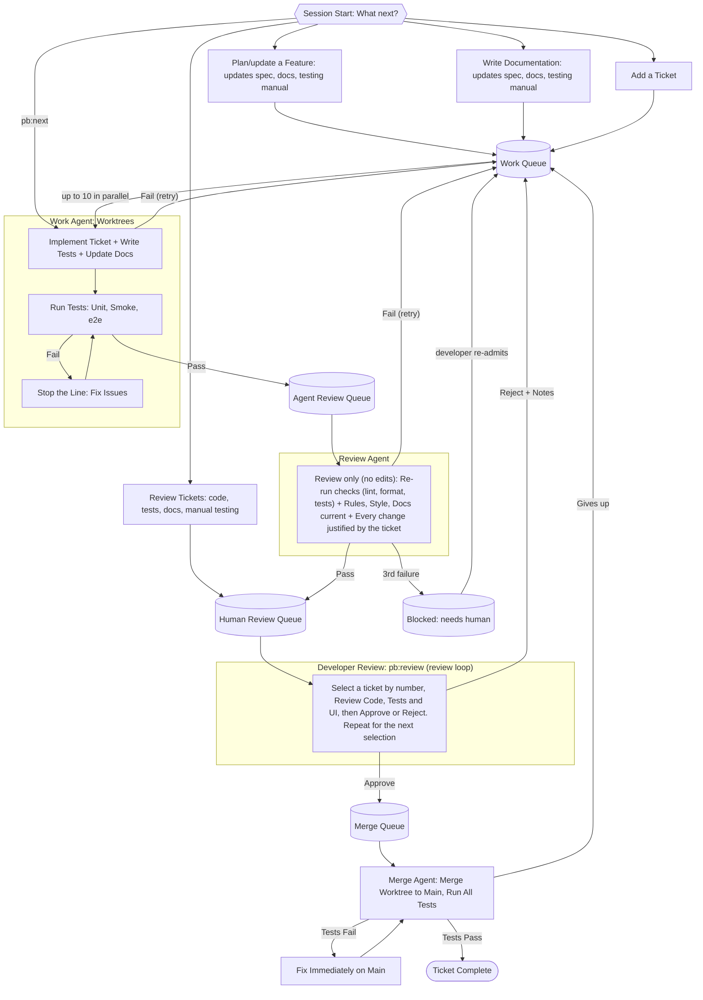
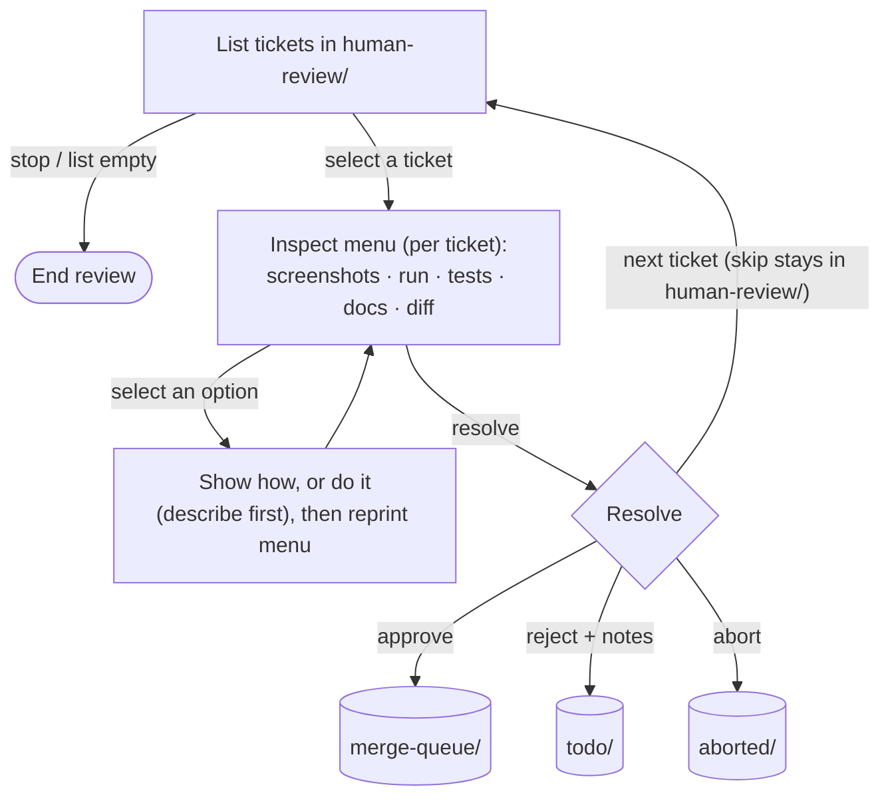

# Handbook

The full, human-facing reference for the semi-autonomous AI development process: how it works and how to use it. The concise version Claude reads at session start is [docs/process.md](docs/process.md); the orientation map of what lives where is [index.md](index.md).

It uses a work queue as the central source of truth, a set of Claude skills to drive each stage, and three repos: a playbook that holds the process and skills, and nested repos for the project (the project repo) and tracking the state of the process (the state repo).

## Glossary

The definitions of the terms used throughout this handbook live in [glossary.md](glossary.md).

## The loop at a glance

The developer plans the work, Claude builds and self-reviews it, the developer reviews and approves or rejects.



## The Human in the Loop

This process is semi-autonomous, not autonomous. Claude does the labour (planning detail, implementation, tests, documentation, and automated reviews), but a person stays in control at the points that matter: what gets built, and whether the result is good enough to keep. The aim is to take the mechanical work off the developer while never letting unreviewed code reach `main`.

The developer is in the loop at the two ends of the pipeline, and out of it in the middle:

- **In the loop, at the start (deciding what to build).** Work enters the queue only when the developer puts it there, through `/pb:plan`, `/pb:add`, `/pb:docs`, and `/pb:customize`. The developer sets the spec, the acceptance criteria, and the rules the work is judged against.
- **Out of the loop, in the middle (the autonomous run).** `/pb:next` takes unblocked work from `todo/` all the way to `human-review/` without asking for input: implementing, testing, and running an automated review on every ticket. The developer can watch `current-state.md`, but nothing requires them to.
- **In the loop, at the end (the approval gate).** `human-review/` is the one place a person decides. In `/pb:review` the developer reads the diff and the captured evidence and approves (it merges), rejects with notes (it returns to `todo/` for rework), or skips. Nothing merges without that explicit yes.

Two other moments need a human and only a human: a blocked ticket (parked after repeated failure) re-enters the loop only when the developer moves it back to `todo/`, and a broken `main` is handed back for the developer to fix. Everywhere else the process runs itself. The automated agent-review gate exists precisely so the developer's review time is spent only on work that has already passed the mechanical checks.

## Setup

Clone the playbook for each project you want to work on. 

Launch Claude Code from the root of the playbook repo.

> **Permissions warning.** The committed `.claude/settings.json` sets `bypassPermissions`, so Claude Code runs with permission prompts **off** wherever the playbook repo is launched, including your own host. Run it inside the sandbox VM (see Maximising Autonomy > Sandbox VM) so the blast radius is the VM, not your machine.

### Forking (optional)

The playbook is meant to be customised. To tune the skills, rules, and templates to your needs and keep your changes, fork it first and clone your fork instead of this repo wherever the variants below say to clone. If you just want to try it, skip this and clone the playbook directly.

### Host only

Try the playbook on your development computer:

1. Clone the playbook (or your fork, if you made one). 
2. Launch Claude Code from the playbook repo root to start your development session. (Prerequisites `git`, `bun`, and Claude Code are assumed already installed on the host.)

### Host + VM

For autonomous runs. The VM contains the blast radius so `/pb:next` works unattended. Repos live on the host and are shared into the VM (see Maximising Autonomy > Sandbox VM).

1. On the host, clone the playbook (or your fork, if you made one).
2. Spin up the VM (Multipass or equivalent) and share the host's playbook repo into it, so the host and the VM see the same files.
3. In the VM, run `scripts/install-prereqs.sh` to install `git`, `bun`, and Claude Code (if not already installed). It needs root for the `apt` step, so it uses `sudo` (run it as a user with sudo, or as root). The installers add `bun` and `claude` to your shell profile, so open a **new** shell afterwards (or `source ~/.bashrc`); otherwise `claude` is "command not found" in the current one.
4. In the VM, set up git so the loop can commit (see [Git setup in the VM](#git-setup-in-the-vm) below).
5. In the VM, install whatever the project itself needs to build, test, and run.
6. In the VM, launch Claude Code from the playbook repo root, and authenticate it with your account. 

#### Git setup in the VM

The VM has its own git config, separate from the host even though the repo files are shared. The autonomous loop commits to the project and state repos, so give git a commit identity once inside the VM:

```bash
git config --global user.name "Your Name"
git config --global user.email "you@example.com"
```

## Project Bootstrap

Run the bootstrap once per project, on the host or in the VM. A project that has already been bootstrapped skips this entirely; open it and go straight to the loop with `/pb:status`.

### Greenfield Project (`/pb:bootstrap:new`)

Interviews the developer, then scaffolds both per-project repos from the playbook templates and seeds the docs (spec, testing manual, `project/docs/rules/`) from the answers. Leaves you with an empty `state/current-state.md` and queues, ready to run the loop. Full steps are in the [skill](.claude/commands/pb/bootstrap/new.md).

### Existing Project (`/pb:bootstrap:existing`)

Interviews the developer, clones the project into `project/` and creates the state repo at `state/`, then analyses the code for what the process needs but is missing (`CLAUDE.md`, `project/docs/spec/`, `project/docs/testing-manual/`, `project/docs/rules/`, `project/docs/roadmap.md`, smoke/e2e setup, a unit test framework) and queues a ticket to fill each gap. These tickets become dependencies for most future feature work. Full steps are in the [skill](.claude/commands/pb/bootstrap/existing.md).

## Running a Session

Start Claude Code and check where the project stands, then pick a skill. There are two ways to run the process:

- **Host only:** every skill runs on the developer's computer. The simplest way to try it; you answer Claude's permission prompts as they come.
- **Host + VM:** interactive skills (planning, documentation, review, running tests, exploring the UI) run on the developer's computer; skills that spawn sub-agents (`/pb:next`) run in the VM, where permissions are off so Claude works autonomously without stopping to ask.

A typical session (the host/VM labels apply only in host + VM mode; in host only, everything runs on the host):

1. Check where things stand: read `state/current-state.md` directly, or run `/pb:status` (host) for a summary and a recommended next skill.
2. `/pb:plan`, `/pb:docs`, or `/pb:add` (host) to get work into `todo/`.
3. `/pb:next` (VM) to implement everything unblocked through to human review.
4. `/pb:review` (host) to approve or reject the tickets waiting for you; approved tickets merge.
5. Back to `/pb:status`, and repeat.

New to the process? Run `/pb:help`.

## The Development Loop

The loop has a simple rhythm: check where things stand, run a skill that prompts you through the substantive work (planning, reviewing, testing, reading docs, exploring the UI, etc.), then repeat. The skill is what gets invoked, but most of the actual work happens outside Claude. The skills and ticket completion criteria keep Claude on the rails.

`state/current-state.md` is the source of truth for where things stand and is designed to be human-readable at a glance: developers will typically keep it open in their editor and see the current state without asking. From there they can pick a skill directly, or invoke `/pb:status` to have Claude summarise the state and recommend a skill to run next. 

The full pipeline a ticket travels through, from session start to merge:



Any failure, from any stage or source, routes by the ticket's failure count: back to the work queue to retry, or to `blocked/` on the third. See [Handling Failures](#handling-failures).

Each stage is driven by a skill; see [Skills](#skills) for what each one does.

## Handling Failures

A failure is any setback, whatever its source: a sub-agent times out or exhausts its turn budget, a check fails, a merge conflict can't be resolved, a Debug ticket back with no proven root cause, a Fix ticket doesn't solve its problem, or post-merge checks fail on main. They are all handled the same way, so the loop fails loudly and hands back rather than grinding.

**Every failure is recorded.** Whichever agent hits the failure runs `fail-ticket.ts <id>` to increment the ticket's `**Failures:**` count in its `index.md`, and writes a History entry in the ticket's `detail.md` describing what failed and where the evidence is. The count is deterministic (a number in the file, not an agent re-counting), and the History gives the developer the full story of everything that went wrong with the ticket.

**Three strikes parks the ticket.** Below three failures the ticket returns to `todo/` and the loop retries it from the start on a later pass. On the third it moves to `blocked/`, a side pen that is not a pipeline stage: `/pb:next` never retries a blocked ticket, and only a human re-admits it by moving it back to `todo/` (`move.ts <id> todo`) once the cause is addressed. Nothing re-enters the autonomous loop without that explicit action.

**One failure never stops the run; an environmental one does.** A single failed ticket is parked or retried and the development loop carries on with the others. Two or more tickets failing the same stage or check in one run is an **environmental failure**, which stops the run (see [Environmental failure](#environmental-failure) below).

**The developer is told through `state/current-state.md`.** Anything that needs the developer (a block, a broken main, or an environmental failure) is recorded in the top `⚠ Needs your action` section of `state/current-state.md`, which leads the file so it is the first thing seen, directly or via `/pb:status`; routine progress sits below it.

**Exception: broken main.** If a merge lands on main but its post-merge checks then fail, the ticket still goes to `todo/` (not `blocked/`) so fixing main stays actionable, and the run stops because every later ticket builds on main.

### Environmental failure

An **environmental failure** is two or more tickets failing the same stage or check in one run. The cause is the environment, not the tickets (shared test fixtures, a contended resource, a broken tool), so retrying the tickets will not help and the run must stop.

The loop reconciles every failed ticket first (recording and routing each by its count), then stops launching new work and hands back to the developer. It never works around the failure by switching from parallel to serial or re-driving a ticket by hand, the slow-but-grinding mode this design exists to prevent.

The cause is recorded as a `Run halted: environmental failure` entry in the top `⚠ Needs your action` section of `current-state.md`, naming the shared stage or check, the tickets involved, the suspected cause, and the evidence path. The tickets it hit usually return to `todo/`, so this entry is the only record of why the run stopped.

### Interruption and resume

An **interruption** is the run being cut off from outside, not a ticket failing: a session or rate limit, the developer stopping the run, or the agent or machine dying. It is **not** a failure, environmental or otherwise, and is never recorded, counted, or treated as a block: hitting a session limit just means the run ran out of capacity, not that anything is wrong.

When it happens the loop stops launching new work and leaves the queues exactly as they are. The queues are the durable state, so resuming is simply re-running `/pb:next` when the developer chooses: every script is idempotent and the report is the single source of truth, so the run continues from the live queue state, re-driving any ticket the interruption left mid-stage (a fresh evidence pass) rather than failing it. This is the one case where `/pb:next` is re-run before the developer has unblocked anything: an interrupted run is resumed, not restarted.

## Repository Structure

Three repos: the generic playbook (cloned once per project) plus the two per-project repos nested inside it. The split keeps everything generic (the process, the skills, reusable templates and scripts) in the playbook, while everything project-specific (the code, the queues, the current state, the rules for contributing to the project) stays scoped to its project.

### Playbook

Clone this repo once for each project you are working on. Clone it wherever you like: the project and state repos nest inside it, and Claude Code is launched from the repo root. It is a normal git repo, so you fork or clone it and customise the process, skills, and templates to your own needs.

```bash
playbook/
  CLAUDE.md           # Standing instructions, loaded when Claude Code launches from here.
  README.md
  handbook.md         # This handbook. The full process described for humans.
  docs/
    process.md        # The concise process to read by the AI.
    output-format.md  # How skills present output.
    ticket-selection.md  # Shared ticket selection menu.
  index.md            # Orientation map: what lives where across the three repos.
  .claude/            # Claude Code config: commands/pb/ (the skills) and settings.json (permissions off).
  templates/          # Various templates for creating repos and files.
  scripts/            # install-prereqs.sh (install git/bun/Claude Code) and move.ts (move a ticket between queues).
  project/            # The project repo (created by bootstrap).
  state/              # The state repo (created by bootstrap).
```

See the playbook [README.md](README.md) for the full file-by-file layout.

### Project Repo

The actual project code. Whatever app you are building!

The project repo is fully self-contained: nothing in it (code, docs, rules, or templates) references, connects to, or relates to anything outside the project. It knows nothing of the playbook or the state repo. The project repo itself is an ordinary project that just happens to keep a spec in `docs/spec/` and a set of rules in `docs/rules/`.

The layout of code, tests, and project-specific docs is up to the developer and not prescribed. Want test-first, good for you. Want test-last, that's great too. You do you. 

The process only requires that a handful of things exist *somewhere* in the repo and are findable: `CLAUDE.md` at the root, `docs/spec/`, `docs/testing-manual/`, `docs/rules/`, and a `docs/roadmap.md`. Everything else (where source lives, how tests are organised, what other docs exist) is the developer's call.

Here is an example layout:

```bash
project/
  CLAUDE.md
  src/
    test/           # Unit tests (co-located with source)
  scripts/          # Project-specific auxiliary scripts
  smoke/            # Smoke test scripts
  e2e/              # Playwright end-to-end tests
  docs/
    spec/           # The spec for the app.
      README.md
      index.md
      <feature>/    # One subdirectory per feature (nested for sub-features)
        index.md
        detail.md   # Full spec for this feature
    testing-manual/ # Step-by-step manual testing guide (mirrors spec layout)
      README.md
      index.md
      <feature>/
        index.md
        detail.md   # Full manual test steps for this feature
    roadmap.md      # Upcoming ideas that feed the work queue
    how-it-works.md # Architectural overview (derived from spec)
    user-guide.md   # User-facing guide (derived from spec)
    rules/          # The rules to contribute to this repo.
      README.md
      coding-style.md
      testing.md
      documentation.md # Required docs and documentation rules
```

### State Repo

Manages the project's state, so both the developer and Claude know what is happening, what is going to happen, and what has happened. Lives outside the project repo so it stays consistent across worktrees.

```bash
state/
  current-state.md    # Snapshot of current state.
  tickets/
    todo/             # Pending tickets
    in-progress/      # Tickets currently being implemented
    agent-review/     # Tickets awaiting automated review
    human-review/     # Tickets awaiting developer review
    merge-queue/      # Approved tickets waiting to merge
    done/             # Completed tickets
    blocked/          # Parked for the developer after a hard/repeated failure (not a pipeline stage)
    aborted/          # Killed by the developer during pb:review (abandoned, terminal; not a pipeline stage)
```

Each queue holds one directory per ticket, named by the ticket's ID. The directory travels between queues as a unit, so the ticket and its evidence always stay together and lands in together in `done/<id>/`:

```bash
todo/
  <id>/         # Named by the ticket's ID
    index.md    # Brief: ID, type, depends-on, one-line description.
    detail.md   # The full ticket.
    evidence/   # Proof, one subdir per pass (see Verification and Evidence)
      implementation-1/
      review-1/
```

### Pushing code is your responsibility

Bootstrap scaffolds `project/` and `state/` as local git repos only. It does **not** create GitHub repositories or push anything. Create a remote for each yourself and push periodically (the state repo too, so your queues and `current-state.md` are backed up). Playbook will not do this for you.

## Skills

Skills are the `pb:*` slash commands that drive each stage of the process. The developer invokes one and Claude follows its instructions. The set: `/pb:help`, `/pb:status`, `/pb:plan`, `/pb:docs`, `/pb:add`, `/pb:next`, `/pb:review`, `/pb:debug`, `/pb:customize`, and the one-time `/pb:bootstrap:new` / `/pb:bootstrap:existing`. Each is summarised below by what it is for and what it leaves behind; the full procedure for each lives in its skill file under [.claude/commands/pb/](.claude/commands/pb/), which this section does not restate.

### pb:status

Reads `state/current-state.md` and the queues, summarises what was completed, what is in flight or awaiting review, and what is blocked, then recommends the next skill. The usual session-start entry point. See [.claude/commands/pb/status.md](.claude/commands/pb/status.md).

### pb:plan

Plans or revises a feature: brainstorms the design with the developer when it is unclear, then updates `project/docs/spec/` and the docs derived from it (the testing manual, and any how-it-works / user guide the change touches), optionally breaking the feature into dependency-ordered tickets in `state/tickets/todo/`. Design work, not implementation. See [.claude/commands/pb/plan.md](.claude/commands/pb/plan.md).

### pb:docs

Writes or updates documentation (spec, testing manual, how-it-works, roadmap), queuing tickets in `todo/` when the doc changes imply code or test changes. For documentation that is not the design of a new feature (that is `/pb:plan`). See [.claude/commands/pb/docs.md](.claude/commands/pb/docs.md).

### pb:add

Creates one structured ticket in `todo/` for a single, well-understood task. See [.claude/commands/pb/add.md](.claude/commands/pb/add.md).

### pb:next

Drains the queues as far as possible until human input is required. It keeps running turns until forward progress is exhausted, and each turn works the queues it drives in priority order: `merge-queue/` → `agent-review/` → `todo/` → `in-progress/`. The principle is *finish work nearest to done before starting anything new*: it merges approved tickets, then clears every review already in flight, then picks up to 10 unblocked `todo/` tickets into worktrees and runs a per-ticket sub-agent through each stage (implement, agent-review) until the ticket reaches `human-review/`. Draining `agent-review/` ahead of `todo/` keeps tickets flowing through to `human-review/` instead of piling up fresh `in-progress/` work behind a backlog of unreviewed tickets. Each sub-agent runs in the ticket's worktree and advances the ticket only when its ticket completion criteria are met, evidence on disk included. Run it once; it keeps going until forward progress is exhausted, and you don't run it again until the developer unblocks something (e.g. via `/pb:review`). The per-stage criteria text, worktree mechanics, the blocked/-on-failure handling, and the Debug/Fix exceptions are in [.claude/commands/pb/next.md](.claude/commands/pb/next.md).

### Ticket selection menu

When a skill asks the developer to pick ticket(s) from a numbered list, it follows the shared format in [docs/ticket-selection.md](docs/ticket-selection.md), rendered by `format-ticket-selection.ts`. Two modes: **`pick-many`** (one shot — unblock several tickets or `all`) and **`pick-one-loop`** (repeat until stop — used by `/pb:review`). In review, ticket numbers are fixed for the whole session even as tickets are checked off, so the developer can rely on them. The per-ticket **inspect loop** in `/pb:review` is separate: it is an action menu, not ticket selection.

### pb:review

The human approval gate. Walks the developer through each ticket in `human-review/` (diff, captured evidence, tests, UI/CLI, docs), transcribes their notes to the right place, then moves the ticket to `merge-queue/` on approval or back to `todo/` on rejection (rejection requires a note). The developer can also **abort** a ticket (`ab`): it moves to `aborted/` with an optional reason in its History, the work is abandoned, and it is dropped from `current-state.md`. A skipped ticket stays in `human-review/` for later. See [.claude/commands/pb/review.md](.claude/commands/pb/review.md).

**The review loop.** The developer is not marched through the tickets in a fixed order. Instead `/pb:review` runs a loop: it prints the reviewable tickets **numbered from 1** and asks "Which ticket do you want to review?". The developer selects one by **number or name**, is walked through it, and resolves it (approve, reject, skip, or abort). Then the same numbered list and question come back, with the resolved ticket gone (a skipped one stays, so it reappears). The loop repeats until the developer stops (`q`/`quit`/`stop`) or no reviewable tickets remain. This lets the developer choose what to review first and stop whenever they like, rather than being forced through every ticket in queue order.

**The inspect loop (a loop within the loop).** Walking through the currently selected ticket is itself a loop. `/pb:review` prints a numbered **inspect menu** of ways to examine the work and the developer picks them **in any order, one at a time**:

1. Show the screenshots
2. Run it by hand (Claude shows you how)
3. Start it for you (Claude launches the app, you explore it)
4. Run the automated tests
5. Show the doc changes (Claude shows you the diff)
6. Read the docs yourself (Claude points you to them)
7. Show the code diff (Claude shows you the diff)
8. View the code diff yourself (Claude shows you how)

For each pick Claude either **shows the developer how** to do it themselves (e.g. naming the screenshot paths, the testing-manual commands to run the app by hand, the doc files to read, or the `git show` command to view the diff), or **does it for them** (opening the screenshots, starting the app, running the tests, showing a diff), printing a one-line description of what it will do first. When Claude starts the app it only launches it and says what to look at: it does not drive or navigate, and the developer closes it themselves. Then it reprints the menu and waits. The menu is tailored per ticket: a non-UI ticket has no screenshots, so option 1 is dropped, and so on. The developer leaves the inspect loop only by resolving the ticket. So the review loop (select a ticket) contains the inspect loop (examine that ticket).

#### Commands

The developer drives both loops with these commands. Each has a short alias and a full-word form; both are accepted.

| Command | Aliases | When | Does |
|---|---|---|---|
| Select | `<number>`, `<ticket name>` | At the ticket list | Selects the ticket to review (e.g. `1`, or `search-3`). |
| Inspect | `<number>` | At the inspect menu | Runs that menu option; Claude shows you how or does it for you, then reprints the menu. |
| Approve | `a`, `approve` | In a ticket | Approves the ticket; it moves to `merge-queue/`. |
| Reject | `r`, `reject` | In a ticket | Rejects with notes (a note is required); it returns to `todo/`. |
| Skip | `s`, `skip` | In a ticket | Leaves the ticket in `human-review/` for later; no note needed. |
| Abort | `ab`, `abort` | In a ticket | Kills the ticket; it moves to `aborted/` (optional reason). |
| Stop | `q`, `quit`, `stop` | At the ticket list | Ends the review loop. |

#### The review and inspect loops



### pb:debug

The path for "something is broken, find out why." The rule is **no fix without a proven root cause first.** Debugging and fixing are split into two tickets so each is reviewed on its own: a **Debug** ticket proves the root cause (in a throwaway worktree, no commits), and on review it spawns a **Fix** ticket that flows through the pipeline normally. If the developer already knows the fix, they skip this and use `/pb:add`. The investigation method, acceptance criteria, and how the two pipeline stages behave for Debug/Fix tickets are in [.claude/commands/pb/debug.md](.claude/commands/pb/debug.md).

### pb:customize

Tunes the project's enforced rule set in `project/docs/rules/` via an interview (coding style, required documents, testing rules, process rules). Because the agent-review stage reads the whole directory, anything captured here is enforced on every ticket from then on. See [.claude/commands/pb/customize.md](.claude/commands/pb/customize.md).

## Templates

Templates to create repos, files and other content live under [templates/](templates/).

```bash
templates/
  project/         # Project repo scaffold. Copied by pb:bootstrap:new.
  state/           # State repo scaffold. Copied by pb:bootstrap:*.
  feature-template/     # A feature's index.md + detail.md shape. Copied by pb:plan.
  ticket-template/   # A ticket's index.md + detail.md shape. Copied by pb:add.
  commit-template/      # Commit message format. Copied and filled out when making a commit.
```

## Spec Format

Paths in this section are relative to the project repo root.

The spec lives in `docs/spec/`. It is the central source of truth for how the app works. Each feature gets its own subdirectory, and features within features become nested subdirectories.

```bash
docs/spec/
  README.md
  index.md          # Central index
  <feature>/
    index.md        # Lightweight: id, brief description, list of sub-features
    detail.md       # Full spec for this feature
    <sub-feature>/  # Nested the same way, no depth limit
      index.md
      detail.md
```

- Each feature directory contains two files. `index.md` is the lightweight surface: ID, brief description, and a list of any sub-features. `detail.md` is the full spec for that feature (overview, behaviour, acceptance criteria, open questions).
- Sub-features follow the same pattern recursively. There is no depth limit.
- The split lets tooling enumerate features and IDs by reading only `index.md` files. The heavier `detail.md` is loaded only when the full spec is actually needed.

The conventions, ID rules, and templates for these files ship as the project template in [templates/project/docs/spec/](templates/project/docs/spec/) (its `README.md` and `CLAUDE.md`); bootstrap copies them into a new project. Per-feature `index.md`/`detail.md` files are created per project by `/pb:plan`, not shipped as static content; their shape is in [templates/feature-template/](templates/feature-template/) (`index.md` and `detail.md`).

### Feature Format

A feature is a directory of two files: `index.md` (the lightweight surface) and `detail.md` (the full spec). The `index.md` declares the feature's ID, its status fields, a brief description, and a list of sub-features.

#### Feature ID

A feature's ID is declared in the `**ID:**` field of its `index.md`. The ID in the file is the source of truth, not the directory path or the filename.

Rules for IDs:
- An ID is a flat kebab-case token. It never contains slashes, even for nested sub-features.
- IDs are globally unique across the spec. A sub-feature does not inherit its parent's ID; it picks its own (e.g. `<sub-feature>`, or `<parent>-<sub-feature>` if a flat name would clash).
- The same applies to any other indexable ticket (tickets, etc.): the ID is declared inside the file, not inferred from the path.

Tooling that needs to resolve an ID to a path should read the `**ID:**` field of each `index.md` and build an index, rather than inferring the ID from the directory. The feature ID is how tickets reference features (see Ticket Format).

#### Status fields

Each feature `index.md` declares two status fields that capture orthogonal axes:

- `**Spec:**` is the state of the spec itself. `Draft` means it is still being written or has open questions to settle. `Settled` means the spec is finished and ready to build against.
- `**Implementation:**` is how far the code has caught up. `None` means nothing built yet. `Partial` means some acceptance criteria are met. `Complete` means all acceptance criteria are met. It rolls up the checkboxes in the `detail.md` acceptance criteria.

A `Settled` spec with `Implementation: None` is the canonical "planned." A `Draft` spec with `Implementation: Complete` flags drift: the code has moved ahead of the agreed behaviour. A retired feature uses `Spec: Settled` with a `**Deprecated:** <date or reason>` field added to mark it as on the way out. These fields describe the long-lived state of the feature; ticket state in the queues is separate and describes only the in-flight tasks.

### Rules

- Every feature has a directory containing two files: `index.md` (lightweight: ID, brief description, sub-feature list) and `detail.md` (the full spec).
- A feature's ID is declared in its `index.md` `**ID:**` field. IDs are flat kebab-case tokens and globally unique.
- The spec is the source of truth. Ticket acceptance criteria are derived from the `detail.md`, not invented in the ticket.
- When the spec changes, affected tickets, tests, and the testing manual section are regenerated or updated.
- `docs/spec/index.md` always lists every top-level feature. Each feature's `index.md` lists its direct sub-features.
- Every entry in an index includes the child's `**ID:**`, a brief description, and a link to the child's `index.md`. The full set of IDs and feature summaries can be enumerated by reading only `index.md` files; the heavier `detail.md` is loaded only on demand.

## Testing Manual Format

`docs/testing-manual/` mirrors `docs/spec/` exactly: the same subdirectory layout, the same feature IDs, and an `index.md` in every directory. Where the spec has `detail.md` (the full spec), the testing manual also has `detail.md` (the full manual test steps for that feature). So `docs/spec/<feature>/detail.md` has a matching `docs/testing-manual/<feature>/detail.md`. The top-level `docs/testing-manual/index.md` is the central index of manual test guides.

## Derived Documentation

The spec is the source of truth, but it is concise and structured for tooling. Humans (developers, end users, operators) often need longer-form explanations. Those live as siblings of `docs/spec/` under `docs/`:

- `docs/how-it-works.md`: internal/architectural overview. Key components, data flow, where things live. Derived from the spec.
- `docs/architecture.md` (or whatever the project calls it): the system's structure and the design decisions behind it. Derived from the spec.
- `docs/user-guide.md` (or whatever the project calls it): user-facing documentation showing how to use the app. Derived from the spec's behaviour sections.
- Project-specific docs (tutorials, runbooks, API references, etc.) follow the same pattern.

Derived docs expand on the spec with extra detail; they should not restate it. When the spec changes, the derived docs are regenerated or updated to match. The testing manual under `docs/testing-manual/` is one specific instance of this pattern; the rest are looser-form prose.

### Changes can start anywhere

The spec is the source of truth, but it is not always where work begins. Edits can come in from any surface: the spec, a derived doc, the testing manual, or the code itself. Whichever changes first, the others are brought back into sync. Any conflict resolves in the spec's favour.

This applies on the first iteration as much as on the hundredth:

- **First iteration, docs-first.** Sketch the user-facing guide in prose to find clarity on what the app should do from the user's perspective, then formalise it as the spec. Good when the shape of the feature is unclear and you want to think it through in narrative form.
- **First iteration, spec-first.** Write the spec (behaviour, acceptance criteria) directly, then expand into docs and the testing manual. Good when the behaviour is already clear and you want to pin down the contract before writing prose.
- **Ongoing edits, from anywhere.** Touch the spec, a derived doc, the testing manual, or the code. The AI fans the change out: a spec edit propagates to code, tests, manual, and docs; a doc or testing-manual edit reconciles back into the spec and then out to the rest; a code edit updates the spec and manual to reflect the new behaviour.

`/pb:plan` and `/pb:docs` both accept changes from any entry point and walk through the affected artifacts.

## Ticket Format

Each ticket is a directory named by its ID, sitting directly under a queue (e.g. `state/tickets/todo/<id>/`). The directory holds `index.md` (brief: the ticket's surface) and `detail.md` (the full ticket) and, once any proof is captured, an `evidence/` subdirectory. The queues are flat: ticket directories sit directly under the queue with no nested hierarchy mirroring the spec.

The ticket's ID is declared inside `index.md` in an `**ID:**` field; the directory name mirrors it by convention, but the field is the source of truth. The ID has the form `{feature-id}-{n}`, where `{feature-id}` is the ID declared in the corresponding feature's `index.md` and `n` increments per feature. When the ticket moves between queues (`todo/` to `in-progress/` to `agent-review/` etc.), the whole directory moves under the new queue root, carrying its `index.md`, `detail.md`, and `evidence/` with it.

Because the directory name mirrors the ID, listing a queue directory enumerates the IDs of every ticket in that queue without opening any file. This plays the same role for tickets that index files play for features: the full set of IDs is discoverable cheaply.

The ticket's `index.md` is brief: it carries `**ID:**`, `**Type:**`, an optional `**Depends on:**`, a `**Failures:**` count (see [Handling Failures](#handling-failures)), and a one-line description (no status field, since the queue the ticket sits in is its status). The ticket's `detail.md` carries the full ticket: Description, Acceptance Criteria, Test Plan, Implementation Notes, Testing Notes, Notes, and History sections. For a Debug ticket, the root-cause write-up lives in `detail.md`. The full shape is in [templates/ticket-template/](templates/ticket-template/) (its `index.md` and `detail.md`).

Rules:
- The work agent must refuse to implement a ticket that is missing acceptance criteria.
- A Test Plan is required, but for tickets with no testable behaviour (pure scaffolding, doc-only changes, dependency bumps, etc.) the Test Plan may be `N/A: <reason>` and must be paired with a Manual Verification section listing the steps the developer will run during human review (look at the file, run the linter, render the doc, etc.). Code never reaches `merge-queue/` without some check, automated or manual.
- `**Type:**` is free-form. Common values are `Feature`, `Tweak`, `Test coverage`, `Doc`, `Scaffolding`, `Refactor`. Projects can add their own. Type is mostly used for filtering and reporting, not enforcement. The two exceptions are `Debug` and `Fix`, which change how the agent-review stage behaves (see `/pb:debug`): a `Debug` ticket is reviewed for a proven root cause and, on pass, spawns a `Fix` ticket; a `Fix` ticket is reviewed for a minimal change that solves the proven problem with evidence.
- Each ticket gets an ID of the form `{feature-id}-{n}`, where `n` increments per feature. Tickets not tied to a feature use a catch-all ID prefix like `chore`, `fix`, `misc` `infra` or whatever you want.
- Where possible, number `n` in order of execution, so a dependent ticket gets a higher number than the tickets it depends on. The number is only a hint at reading order; `**Depends on:**` is what actually gates execution.
- Dependencies reference other ticket IDs. Dependent tickets cannot be started until their dependencies are merged.
- A human rejection is not a failure: its feedback is appended to the History section in `detail.md` and the ticket returns to `todo/` for rework with its `**Failures:**` count reset to 0 (`reset-failures.ts`), a clean slate.

## Commit Format

Every commit follows one template, so history stays uniform and each commit traces back to the ticket that produced it. The subject is `<id>: <imperative summary>`; the body carries the prose, an optional `Acceptance criteria:` list, and `Type:` / `Ticket:` trailers tooling can grep by.

The template lives at [templates/commit-template/commit-template.txt](templates/commit-template/commit-template.txt). The `/pb:next` sub-agents make the commits using this template.

## Current State Format

The queue directories are the source of truth for the state of things. `current-state.md` is the curated narrative layer on top, summarising what the developer needs to know at a glance:

- What is in progress
- What is waiting on the developer
- What is blocked and why
- What was recently completed
- Anything that needs developer attention: tickets parked in `blocked/` and why, sub-agent timeouts, repeated failures on the same ticket, merges left on main in a broken state

Sub-agents update this file whenever a ticket changes queue or something significant happens that requires manual rectification. Keep it scannable: short, structured, no prose padding.

## Claude Code Configuration

### CLAUDE.md files

`CLAUDE.md` files give Claude directory-scoped rules, auto-loaded by Claude Code when it works in or below that directory. Each repo carries its own, shipped as a template and copied in at bootstrap: the playbook's root `CLAUDE.md` (loaded when Claude Code launches from the playbook repo root), the project repo's root `CLAUDE.md` and `docs/spec/CLAUDE.md`, and the state repo's root `CLAUDE.md` and `tickets/CLAUDE.md`. Keep each one small and scoped to the rules that matter in that tree; the files themselves are the source of truth, so this handbook does not restate their contents.

#### Rule set: `docs/rules/`

The project's enforced rules live in `docs/rules/`. The agent-review stage (see `/pb:next`) reads the whole directory, so every file here is enforced by the review agent. The bootstrap interview fills in the starting rules; `/pb:customize` revises them and can add new rule files. Referencing the directory (not a fixed list of files) means a new rule category is just a new file, with no skill edit needed.

The directory ships with three rule files plus a `README.md`, all in [templates/project/docs/rules/](templates/project/docs/rules/); projects add more as needed:

- `coding-style.md`: project-specific style (naming, formatting, file layout, idioms) filled in during bootstrap, plus the default minimalism rules (keep it minimal, minimise complexity, don't overengineer, keep it as simple as possible) that ship with every project.
- `testing.md`: which kinds of tests are required and when (unit always, smoke for endpoints, e2e for UI flows), coverage expectations, and how to run each suite. Filled in during bootstrap and revised with `/pb:customize`.
- `documentation.md`: which documents the project requires beyond the always-required set (`CLAUDE.md`, `docs/spec/`, `docs/testing-manual/`, `docs/rules/`, `docs/roadmap.md`), and the rules for keeping them current. The agent-review stage checks this file, so a required doc that is missing or stale fails review.

### docs/process.md (playbook)

A concise machine-readable description of this process. Claude reads it at session start so it knows how to behave. Lives in the playbook ([docs/process.md](docs/process.md)) so every project gets the same canonical version. Keep it short and direct; the full description is in this handbook.

### index.md files

An `index.md` is a lightweight index: it names what lives in its directory and links to the children, so a whole tree can be enumerated by reading only the `index.md` files without opening the heavier content beside them. The convention recurs across the repos, and each is kept current as its directory's contents change:

- The playbook's top-level [index.md](index.md) is the orientation map for Claude: what lives where across the playbook and a project's project/state repos. Cheap to load, enough to navigate without reading this handbook end to end.
- In the project repo, in `docs/spec/` and `docs/testing-manual/`, each directory's `index.md` lists its features/sub-features with their IDs, so tooling resolves the full set without loading every `detail.md` (see Spec Format, Testing Manual Format).

## Checks

A **check** is any pass/fail verification of the work. Every check produces a boolean result; they differ only in how that verdict is reached.

### Two kinds

- **Deterministic checks** run a command that yields the verdict: compile, lint, format, unit, smoke, e2e. There is no discretion: the command passes or it does not.
- **Judgement checks** require an agent to analyse the work against a named rule and decide. These cover anything in `project/docs/rules/`, the root and scoped `CLAUDE.md` files in the project repo, and the documents required by `documentation.md`: is the documentation current after this code change, does the code conform to the rule, is the fix the minimal change that solves the problem. Discretion is required, but the output is still a single boolean.

The two are interchangeable in the pipeline. A judgement check is not "softer" than a unit test: it must pass before the ticket advances, exactly like a test. What differs is the evidence behind the verdict (see below).

### Who evaluates them, and when

Checks run inside the `/pb:next` sub-agents, in the ticket's worktree, never against the main repo:

- The **implement** and **merge** sub-agents run the deterministic checks (compile, lint, the test suites) and capture their output.
- The **agent-review** sub-agent is **review-only** and re-verifies independently; the **Agent review** section covers exactly what it does.
- The **parent's end-of-turn reconciliation** re-checks the queues every turn, and each ticket's completion criteria require the evidence on disk, so neither kind of check can be claimed on confidence.
- The **developer** sees the same evidence in `/pb:review` and can re-run or re-judge any of it.

### What a check result records

Whatever its kind, every check result carries the same fields, so deterministic and judgement results read the same way in `evidence/` and in review:

- **Check**: what was verified (e.g. `unit tests`, or `docs/rules/documentation.md`).
- **Method**: how it was performed, the exact command run, or the rule that was analysed.
- **Result**: pass or fail.
- **Basis**: what the verdict rests on, the captured output that was read, or the reasoning that decided a judgement.
- **Fix notes**: on failure, what needs to change to make it pass.

## Agent review

Agent-review is the automated gate between implementation and the human review queue. It is **review-only**: the sub-agent makes no code edits, commits nothing, and its sole writes are to the ticket's own state (move the ticket directory, capture check output to its `evidence/`, and on rejection a History note plus a Failures increment). It never writes `current-state.md`; the parent reflects the outcome there after the turn.

For each review pass N it:

1. **Re-runs the deterministic checks** fresh in the worktree (lint, format, unit tests, smoke tests, and any other project checks), each in the foreground, capturing full output to `evidence/review-N/`. It trusts no earlier run: a sub-agent's report is not a verified result.
2. **Runs the judgement checks:** reads every rule in `project/docs/rules/`, the root and any scoped `CLAUDE.md` for directories touched, and `documentation.md`, and writes a pass/fail assessment (rule named, verdict, reasoning) to `evidence/review-N/`.
3. **Reviews the committed diff hunk by hunk** against the acceptance criteria, confirming every change is required to implement the ticket, and captures that assessment to `evidence/review-N/`. Any change that is not required, whatever its nature (committed evidence-collection code being the leading example), fails the review.
4. **Resolves**, writing only to the ticket's state: on **pass** (every check passes and every change is justified) it moves the ticket from `agent-review/` to `human-review/`; on **fail** (any check fails or any change is unjustified) it records a History note, runs `fail-ticket.ts`, and routes per the failure rules (back to `todo/` for the implement stage to redo, or `blocked/` at the third failure). It never fixes the work it judges.

Debug and Fix tickets vary step 4 (see `/pb:debug`).

## Verification and Evidence

A claim of "done" must be supported by evidence. Before any agent claims a check passes, it runs the check fresh, reads the full output, and saves that output as a file. A ticket's completion criteria require the file to exist, so completion cannot be claimed on confidence alone.

### The verification rule

Every agent, at every stage, follows the same sequence before claiming a check passes:

1. **Identify** the exact command that proves the claim.
2. **Run** it fresh. Never reuse an earlier run or a cached result.
3. **Read** the full output, including the exit code and any failure count.
4. **Confirm** the output actually supports the claim.
5. **Capture** the output to the evidence store (below), then claim the result and point at the evidence.

For a judgement check there is no command to run: the agent reads the rule and the relevant code in place of steps 1-3, then captures its written assessment (the rule named, the verdict, and the reasoning) as the evidence in step 5. The discipline is the same: a verdict reached fresh, recorded as a file the parent and developer can both see.

Checks run in the foreground. A sub-agent runs each check and blocks until it returns, within its turn budget; it never launches a long check (e.g. e2e) in the background and ends the turn waiting to be woken, which stalls silently and makes no progress. A check either completes in the turn or the agent hits its limit and the ticket is parked in `blocked/`.

### The evidence store

Proof for each ticket lives in the `evidence/` subdir of the ticket's own directory. Because evidence travels inside the ticket directory, it survives every queue move and is archived self-contained when the ticket reaches `done/<id>/`.

**One subdir per pass.** Each trip through implement and review captures into its own numbered subdir, so a rejected-and-redone ticket keeps the full round-trip history rather than overwriting it:

```
<ticket>/
  evidence/
    implementation-1/   # first implement pass
    review-1/           # first review pass
    implementation-2/   # re-implemented after review-1 rejected it
    review-2/           # second review pass
    ...
    merge/              # post-merge checks on main
```

An agent allocates its subdir by taking one more than the highest existing number for its kind (the first implement pass writes `implementation-1/`, the next `implementation-2/`, and likewise for `review-N/`); the merge stage writes to `evidence/merge/`. What goes in each subdir:

- **Test output.** The full captured run for each suite: `unit.txt`, `smoke.txt`, `e2e.txt` (or per-run files). Exit code visible. Plus any other artefacts the run produces.
- **Screenshots.** For any change that affects the UI, a screenshot of each affected view in **both light and dark mode** (every UI screenshot exists in both modes), in a `screenshots/` subdirectory. Capture them however works, but never by committing capture code to `project/`: a screenshot must need no committed change to the project tree (no added test, helper, or env plumbing). Any capture script lives outside the project tree, in the ticket's `evidence/` dir or a temp dir, and is discarded.
- **Command transcripts.** For anything else a claim rests on (a build log, a migration run, a manual reproduction of a bug), the captured command and its output.

The store is append-only within a run and overwritten on the next run of the same check, so it always reflects the latest verified state. It is the developer's first stop in `/pb:review`: read the captured evidence before re-running anything by hand, and only dig deeper where the evidence is missing or unconvincing.

### Where it is enforced

The capture is written into the success condition of every sub-agent (implement, agent-review, merge) in `/pb:next`, so a ticket cannot move to the next queue until its evidence is on disk. `/pb:debug` captures the bug reproduction the same way. Because the proof is a file the parent and the developer can both see, "I verified it" stops being something the agent asserts and becomes something anyone can check.

## Maximising Autonomy

The goal is for Claude to operate without interruption except at the human approval gate. Three things make this possible.

### Skills

Skills are pre-written instructions that tell Claude exactly how to behave at each stage. Without them, Claude will drift: asking unnecessary questions, varying its approach between sessions, or missing steps. With them, invoking `/pb:next` always produces the same reliable behaviour. Each skill is a markdown file in the playbook under [.claude/commands/pb/](.claude/commands/pb/), exposed to Claude Code as a slash command when launched from the playbook repo. The full set is in the Skills section above.

Skills drive Claude's implementation work and interactive review sessions. They do not enforce rules: rules written in a skill are just instructions Claude may or may not follow. Enforcement comes from each ticket's completion criteria together with the parent's end-of-turn reconciliation.

### Ticket completion criteria

> **Note on `/goal`.** Earlier versions of this process leaned on a `/goal` slash command: a pass condition re-checked after every turn by a "goal evaluator". That mechanism never actually worked from a skill (only a human typing `/goal` invokes it, and one session can hold only one goal), so the `/goal` text was inert. It has been removed. What remains is the plain-English ticket completion criteria each stage carries, gated by the parent's end-of-turn reconciliation, described below. If hard, automatic enforcement is ever wanted back, the route is Claude Code `Stop`/`SubagentStop` hooks, not `/goal`.

**Ticket completion criteria** are the state a session or sub-agent must reach before it is "done". They are plain text in the agent's prompt. They are not self-enforcing: what makes the loop safe is that `pb:next` re-runs `next-tickets.ts` at the end of every turn and refuses to finish while `in-progress/` is non-empty, and that the criteria demand their proof on disk. So an agent cannot quietly claim completion: the queue state and the evidence files are the record, not the agent's say-so.

The criteria have two parts:
- **Success condition:** the externally observable state that means the work is finished (files in specific queues, tests passing, checks green, docs updated, commits made).
- **Abort condition:** a hard stop so a stuck agent does not loop forever: a turn-count limit, or an environmental-failure signal (see [Handling Failures](#handling-failures)). A single stuck ticket does not abort the run; it is parked in `blocked/` and the loop carries on.

The completion criteria cover both jobs that automatic hooks would otherwise handle:

- **Queue transitions.** The success condition names the target queue ("the ticket directory has been moved from `in-progress/` to `agent-review/`"). The sub-agent moves the directory itself when it is ready, via `bun ../scripts/move.ts <id> <target-queue>` (run from `state/`), which handles the paths.
- **Quality checks.** The success condition names the checks that must pass ("lint clean, unit tests pass, smoke tests pass, e2e tests pass"). The sub-agent runs them and fixes failures until they pass; the captured output on disk is the proof.
- **Evidence.** The success condition requires the proof to exist on disk, not just the agent's say-so ("the test output and screenshots are captured to the ticket's `evidence/` subdir"). This turns "should pass" into a file the developer can open. See Verification and Evidence.

The development loop relies on this in three places:

- `/pb:next`'s own top-level loop condition terminates the loop when forward progress is exhausted (`merge-queue/` empty, `agent-review/` empty, every unblocked `todo/` ticket moved downstream).
- Each per-ticket sub-agent (merge, implement, agent-review) has its own completion criteria scoped to that ticket, with its own timeout.
- A sub-agent that cannot meet its completion criteria records the failure and the ticket routes by its count (retry via `todo/`, or `blocked/` on the third), recorded in `current-state.md`. The loop never re-drives a ticket or falls back to serial, and an environmental failure stops it. See [Handling Failures](#handling-failures).

The full criteria text used at each stage is in [.claude/commands/pb/next.md](.claude/commands/pb/next.md). To interrupt early, stop the run; `/pb:status` shows the live state from the queues.

### Sandbox VM (Multipass or similar)

By default Claude Code asks for a command approval before running shell commands, writing files, or calling tools. Every approval halts `/pb:next` until the developer answers it, which defeats the point of an unattended loop.

Pre-approving specific commands in `.claude/settings.json` (test runners, linter, formatter, git, smoke scripts) sounds reasonable but does not scale: Claude reliably finds new command shapes that fall outside the allowlist (a new flag, a piped variant, a command nested inside `bash -c`), and each one halts the loop. Maintaining the allowlist becomes its own task, and approval requests still keep slipping through whenever Claude reaches for a command no one anticipated.

The answer is to turn permissions off and run Claude inside a VM, while sharing the repos between the host and the VM so the developer keeps full, live visibility:

1. Spin up a lightweight Ubuntu VM with Multipass (or equivalent).
2. Clone the playbook repo on the host; bootstrap creates the project and state repos inside it. Share that directory into the VM (e.g. `multipass mount`), so the host and the VM operate on the same files.
3. In the VM, install the prerequisites and launch Claude Code from the playbook repo root (see Setup). The committed `.claude/settings.json` runs with permission prompts off, so `/pb:next` never stalls waiting for approval.
4. Claude runs the loop in the VM, editing the shared repos. The developer works on the host: reading code, running the app, watching `current-state.md`, and doing reviews, all live, because the files are the same.

What the VM contains is command execution: a reckless command hits the VM's own OS and tooling, not the host system. The repos are deliberately shared, so they sit outside that wall; git is what protects them. Every change is committed and revertible, and changes surface in `/pb:review` before they land. The developer never has to leave the host to see what Claude is doing.

This applies to both repos, by two distinct mechanisms:

- **Project repo.** Code changes happen in a per-ticket worktree and are committed there using the commit template (`templates/commit-template/`). `merge-ticket.ts` stacks the approved worktrees onto one train worktree and fast-forwards them onto the project branch together.
- **State repo.** The state repo is itself a git repo whose history is an audit log: every significant change (a stage transition, a ticket admitted, a failure recorded, a failure reset, a ticket created, a `current-state.md` update) is committed as its own ticket-scoped commit. The mutation scripts (`move`, `setup-ticket`, `fail-ticket`, `reset-failures`) commit automatically; agents commit free-form edits with `commit-state.ts`. Ticket-scoped pathspecs plus a lock-retry loop keep the up-to-10 parallel `pb:next` sub-agents from producing muddled or colliding commits. So `git -C state log --oneline` reads as a per-ticket trail of how each ticket moved through the pipeline, and any state change can be reverted.
