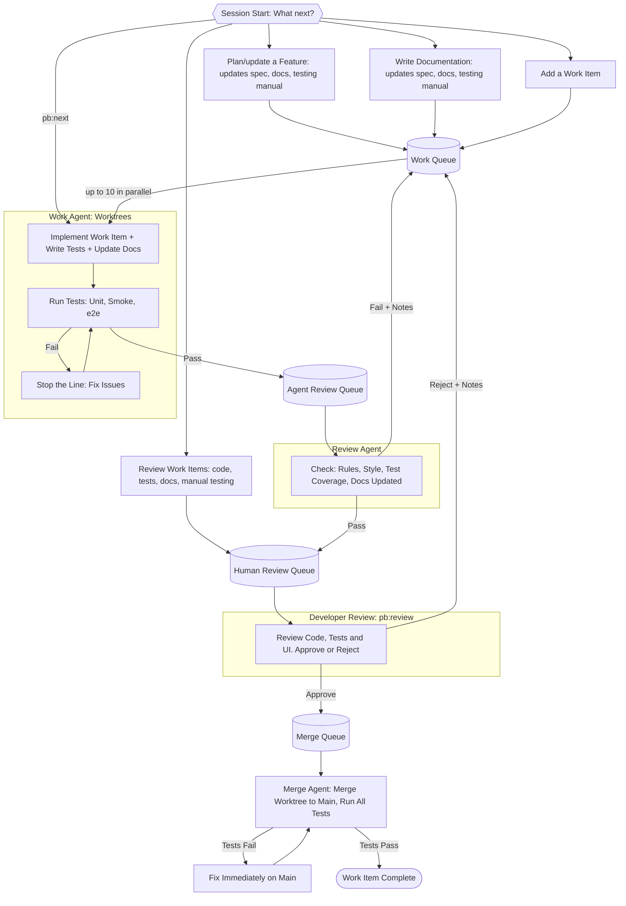

# Handbook

STATUS: REVIEWED

The full, human-facing reference for the semi-autonomous AI development process: how it works and how to use it. The concise version Claude reads at session start is [process.md](process.md); the orientation map of what lives where is [index.md](index.md).

This process turns Claude into a development partner. It uses a work queue as the central source of truth, a set of Claude skills to drive each stage, and three repos: a playbook that holds the process and skills (one copy across all projects), and a pair of per-project repos for the code (project repo) and the process state (state repo).

## Glossary

- **Playbook**: the repo holding the process, skills, templates, and scripts. One clone per machine, shared by every project.
- **Project repo**: the application's own code and docs (spec, rules). Self-contained; knows nothing of the playbook or state repo.
- **State repo**: per-project process state: the work-item queues and `current-state.md`. Lives outside the project repo.
- **Skill**: a `pb:*` slash command that drives one stage of the process (e.g. `pb:next`). Skills instruct; they do not enforce.
- **Work item**: a unit of work: a directory (`index.md` and `detail.md` plus an `evidence/` subdir) named by its ID, that travels through the queues.
- **Queue**: one of six pipeline directories under `state/work-items/`: `todo/` → `in-progress/` → `agent-review/` → `human-review/` → `merge-queue/` → `done/`.
- **`current-state.md`**: the curated, human-readable summary of where things stand, sitting on top of the queues.
- **Goal (`/goal`)**: a pass condition checked after every turn; an agent is not "done" until it holds. Goals enforce what skills only instruct.
- **Goal evaluator**: the mechanism that re-checks a `/goal` against the repos after each turn.
- **Sub-agent**: an agent `pb:next` spawns to take one work item through one stage, running in that item's worktree. The pipeline diagram's **Work / Review / Merge Agent** are sub-agents at the implement, agent-review, and merge stages.
- **Worktree**: a git working tree per work item, so parallel items do not collide and a sub-agent cannot touch the main repo by accident.
- **Check**: any pass/fail verification of the work, either deterministic (a command: compile, lint, unit, smoke, e2e) or judgement (an agent analysing against a rule). See the Checks section.
- **Stop the line**: halt and fix immediately when a check fails, before moving on.
- **Evidence**: captured proof (test output, screenshots, transcripts) in a work item's `evidence/` subdir; goals require it before an item advances.
- **Spec**: the source of truth for app behaviour, in `docs/spec/`. Tests, the testing manual, and derived docs all follow from it.
- **Install**: the one-time, per-machine setup (`scripts/install.sh`) that wires the playbook into Claude Code. Distinct from bootstrap, which is per-project.
- **Bootstrap**: the one-time, per-project setup (`pb:bootstrap:*`) that scaffolds the repos. Distinct from install, which is per-machine.
- **Host**: the developer's own computer, where the repos live and interactive work (planning, review, exploring the UI) runs.
- **VM**: a lightweight virtual machine that runs Claude with permissions off for autonomous work (`pb:next`); the host's repos are shared into it.

## Playbook Installation

One-time setup that wires the playbook into Claude Code: its global instructions and the `/pb:*` skills. Distinct from the per-project `pb:bootstrap:*` skills (next section): install once per machine, bootstrap once per project. Two variants, matching the two run modes (see Running a Session).

### Forking (optional)

The playbook is meant to be customised. To tune the skills, rules, and templates to your needs and keep your changes, fork it first and clone your fork instead of this repo wherever the variants below say to clone. If you just want to try it, skip this and clone the playbook directly.

### Host only

For trying the process on your own computer, no VM. Permissions stay on, so Claude asks before it acts.

1. Make a working directory and, inside it, clone the playbook (or your fork, if you made one) and create your repos, so everything shares one tree.
2. Install the prerequisites with `playbook/scripts/install-prereqs.sh`: `git`, `bun`, Claude Code.
3. Wire the playbook into that directory's local `.claude/`: symlink `CLAUDE.md` → `playbook/config/PLAYBOOK-CLAUDE.md` and `.claude/commands/pb` → `playbook/skills/pb`. Do **not** link `config/settings.json` (that is the permissions-off file, for the VM only).
4. Launch Claude Code from that directory. Start your development session.

### Host + VM

For autonomous runs: the VM disables permissions so `pb:next` works unattended. Repos live on the host and are shared into the VM (see Maximising Autonomy > Sandbox VM).

1. On the host, clone the playbook (or your fork, if you made one) to `~/playbook`.
2. Spin up the VM (Multipass or equivalent) and share the host directory holding your repos into it, so the host and the VM see the same files.
3. In the VM, run `~/playbook/scripts/install-prereqs.sh` to install `git`, `bun`, and Claude Code.
4. In the VM, run `~/playbook/scripts/install.sh` to wire the playbook into the VM's Claude Code (this links `config/settings.json`, turning permission prompts off).
5. In the VM, install whatever the project itself needs to build, test, and run.

## Project Bootstrap

Run the bootstrap once per project, on the host or in the VM. A project that has already been bootstrapped skips this entirely; open it and go straight to the loop with `pb:status`.

### Greenfield Project (`pb:bootstrap:new`)

Interviews the developer, then scaffolds both per-project repos from the playbook templates and seeds the docs (spec, testing manual, `docs/rules/`) from the answers. Leaves you with an empty `current-state.md` and queues, ready to run the loop. Full steps are in the [skill](skills/pb/bootstrap/new.md).

### Existing Project (`pb:bootstrap:existing`)

Interviews the developer, creates the state repo (leaving the project repo in place), then analyses the code for what the process needs but is missing (`CLAUDE.md`, `docs/spec/`, `docs/testing-manual/`, `docs/rules/`, `docs/roadmap.md`, smoke/e2e setup, a unit test framework) and queues a work item to fill each gap. These items become dependencies for most future feature work. Full steps are in the [skill](skills/pb/bootstrap/existing.md).

## Running a Session

Start Claude Code and check where the project stands, then pick a skill. There are two ways to run the process:

- **Host only:** every skill runs on the developer's computer. The simplest way to try it; you answer Claude's permission prompts as they come.
- **Host + VM:** interactive skills (planning, documentation, review, running tests, exploring the UI) run on the developer's computer; skills that spawn sub-agents (`pb:next`) run in the VM, where permissions are off so Claude works autonomously without stopping to ask.

A typical session (the host/VM labels apply only in host + VM mode; in host only, everything runs on the host):

1. Check where things stand: read `current-state.md` directly, or run `pb:status` (host) for a summary and a recommended next skill.
2. `pb:plan`, `pb:docs`, or `pb:add` (host) to get work into `todo/`.
3. `pb:next` (VM) to implement everything unblocked through to human review.
4. `pb:review` (host) to approve or reject the items waiting for you; approved items merge.
5. Back to `pb:status`, and repeat.

New to the process? Run `pb:help`.

## The Development Loop

The loop has a simple rhythm: check where things stand, run a skill that prompts you through the substantive work (planning, reviewing, testing, reading docs, exploring the UI, etc.), then repeat. The skill is what gets invoked, but most of the actual work happens outside Claude. The skills and goals keep Claude on the rails.

`current-state.md` is the source of truth for where things stand and is designed to be human-readable at a glance: developers will typically keep it open in their editor and see the current state without asking. From there they can pick a skill directly, or invoke `pb:status` to have Claude summarise the state and recommend a skill to run next. 

The full pipeline a work item travels through, from session start to merge:



Each stage is driven by a skill; see [Skills](#skills) for what each one does.

## Repository Structure

Three repos: one shared across all projects, two per project. The split keeps everything generic (the process, the skills, reusable templates and scripts) in one place so improvements flow to every project, while everything project-specific (the code, the queues, the current state, the rules for contributing to the project) stays scoped to its project.

### Playbook

Lives in a known location on the host (e.g. `~/playbook/`). One clone per machine, not per project: every project on that machine points at this same clone, so an improvement made here is picked up by all of them at once. It is a normal git repo, so you fork or clone it and customise the process, skills, and templates to your own needs, pulling in upstream improvements when you want them.

```bash
playbook/
  README.md
  handbook.md         # This handbook. The full process described for humans.
  process.md          # The concise process to read by the AI.
  index.md            # Orientation map: what lives where across the three repos.
  config/             # Machine-level Claude config, symlinked into ~/.claude/ by install.sh.
  skills/             # The playbook AI skills library.
  templates/          # Various templates for creating repos and files.
  scripts/            # install.sh (wire in the playbook) and move.ts (move a work item between queues).
```

See the playbook [README.md](README.md) for the full file-by-file layout.

### Project Repo

The actual project code. Whatever app you are building!

The project repo is fully self-contained: nothing in it (code, docs, rules, or templates) references, connects to, or relates to anything outside the project. It knows nothing of the playbook or the state repo. The project repo itself is an ordinary project that just happens to keep a spec in `docs/spec/` and a set of rules in `docs/rules/`.

The layout of code, tests, and project-specific docs is up to the developer and not prescribed. Want test-first, good for you. Wnat test-last, that's great too. You do you. 

The process only requires that a handful of things exist *somewhere* in the repo and are findable: `CLAUDE.md` at the root, `docs/spec/`, `docs/testing-manual/`, `docs/rules/`, and a `docs/roadmap.md`. Everything else (where source lives, how tests are organised, what other docs exist) is the developer's call.

Here is an example layout:

```bash
project/
  CLAUDE.md
  src/
    test/           # Unit tests (co-located with source)
  scripts/          # Project-specific auxiliary scripts
  smoke/            # Smoke test scripts
  e2e/              # Playwright end-to-end tests
  docs/
    spec/           # The spec for the app.
      README.md
      index.md
      <feature>/    # One subdirectory per feature (nested for sub-features)
        index.md
        detail.md   # Full spec for this feature
    testing-manual/ # Step-by-step manual testing guide (mirrors spec layout)
      README.md
      index.md
      <feature>/
        index.md
        detail.md   # Full manual test steps for this feature
    roadmap.md      # Upcoming ideas that feed the work queue
    how-it-works.md # Architectural overview (derived from spec)
    user-guide.md   # User-facing guide (derived from spec)
    rules/          # The rules to contribute to this repo.
      README.md
      coding-style.md
      testing.md
      documentation.md # Required docs and documentation rules
```

### State Repo

Manages the project's state, so both the developer and Claude know what is happening, what is going to happen, and what has happened. Lives outside the project repo so it stays consistent across worktrees.

```bash
state/
  current-state.md    # Snapshot of current state.
  work-items/
    todo/             # Pending work items
    in-progress/      # Items currently being implemented
    agent-review/     # Items awaiting automated review
    human-review/     # Items awaiting developer review
    merge-queue/      # Approved items waiting to merge
    done/             # Completed items
```

Each queue holds one directory per work item, named by the item's ID. The directory travels between queues as a unit, so the item and its evidence always stay together and lands in together in `done/<id>/`:

```bash
todo/
  <id>/         # Named by the work item's ID
    index.md    # Brief: ID, type, depends-on, one-line description.
    detail.md   # The full work item.
    evidence/   # Evidence the implementation was successful.
      unit.txt
      smoke.txt
      screenshots/
```

## Skills

Skills are the `pb:*` slash commands that drive each stage of the process. The developer invokes one and Claude follows its instructions. The set: `pb:help`, `pb:status`, `pb:plan`, `pb:docs`, `pb:add`, `pb:next`, `pb:review`, `pb:debug`, `pb:customize`, and the one-time `pb:bootstrap:new` / `pb:bootstrap:existing`. Each is summarised below by what it is for and what it leaves behind, with the at-a-glance list in the [Skills Reference](#skills-reference); the full procedure for each lives in its skill file under [skills/pb/](skills/pb/), which this section does not restate.

### pb:status

Reads `current-state.md` and the queues, summarises what was completed, what is in flight or awaiting review, and what is blocked, then recommends the next skill. The usual session-start entry point. See [skills/pb/status.md](skills/pb/status.md).

### pb:plan

Plans or revises a feature: brainstorms the design with the developer when it is unclear, then updates `docs/spec/` and the docs derived from it (the testing manual, and any how-it-works / user guide the change touches), optionally breaking the feature into dependency-ordered work items in `todo/`. Design work, not implementation. See [skills/pb/plan.md](skills/pb/plan.md).

### pb:docs

Writes or updates documentation (spec, testing manual, how-it-works, roadmap), queuing work items in `todo/` when the doc changes imply code or test changes. For documentation that is not the design of a new feature (that is `pb:plan`). See [skills/pb/docs.md](skills/pb/docs.md).

### pb:add

Creates one structured work item in `todo/` for a single, well-understood task. See [skills/pb/add.md](skills/pb/add.md).

### pb:next

Drains the queues as far as possible until human input is required. It sets a top-level `/goal`, then each turn processes `merge-queue/` first, picks up to 10 unblocked `todo/` items into worktrees, and runs a per-item sub-agent through each stage (implement, agent-review) until the item reaches `human-review/`. Each sub-agent runs in the item's worktree and advances the item only when its goal is met, evidence on disk included. Run it once; it keeps going until forward progress is exhausted, and you don't run it again until the developer unblocks something (e.g. via `pb:review`). The per-stage goal text, worktree mechanics, timeout handling, and the Debug/Fix exceptions are in [skills/pb/next.md](skills/pb/next.md).

### pb:review

The human approval gate. Walks the developer through each item in `human-review/` (diff, captured evidence, tests, UI/CLI, docs), transcribes their notes to the right place, then moves the item to `merge-queue/` on approval or back to `todo/` on rejection (rejection requires a note). See [skills/pb/review.md](skills/pb/review.md).

### pb:debug

The path for "something is broken, find out why." The rule is **no fix without a proven root cause first.** Debugging and fixing are split into two work items so each is reviewed on its own: a **Debug** item proves the root cause (in a throwaway worktree, no commits), and on review it spawns a **Fix** item that flows through the pipeline normally. If the developer already knows the fix, they skip this and use `pb:add`. The investigation method, acceptance criteria, and how the two pipeline stages behave for Debug/Fix items are in [skills/pb/debug.md](skills/pb/debug.md).

### pb:customize

Tunes the project's enforced rule set in `docs/rules/` via an interview (coding style, required documents, testing rules, process rules). Because the agent-review goal reads the whole directory, anything captured here is enforced on every work item from then on. See [skills/pb/customize.md](skills/pb/customize.md).

## Skills Reference

| Skill | Purpose |
|---|---|
| `pb:help` | Explain the process to the developer: what it is, how to bootstrap, how to drive the development loop, which skills do what, and which queues a work item travels through |
| `pb:bootstrap:new` | Bootstrap a greenfield project: interview the developer, create the project repo boilerplate and the state repo, write the initial spec, testing manual, and the rule set in `docs/rules/` |
| `pb:bootstrap:existing` | Bootstrap an existing project: interview the developer, create the state repo, analyse the project repo for gaps, and queue work items to fill them |
| `pb:status` | Read `current-state.md`, summarise recent and in-flight work, and recommend the next skill to invoke based on queue state |
| `pb:plan` | Plan or update a feature: updates the spec, docs, and testing manual, then queues work items |
| `pb:docs` | Write or update documentation: updates spec, docs, and testing manual, then queues work items |
| `pb:add` | Add a single work item described by the developer, with type, dependencies, acceptance criteria, and test plan |
| `pb:next` | Drive the full pipeline: merge any approved items, then implement the next batch of up to 10 unblocked items through to human review |
| `pb:review` | Walk the developer through reviewing and approving items in the human review queue |
| `pb:debug` | File a Debug item that proves the bug's root cause (four-phase method, no fix); on review it spawns a Fix item, both running through the normal pipeline |
| `pb:customize` | Interview the developer and tune the project's enforced rules: coding style, required documents, testing rules, and standing process rules |

## Templates

Templates to create repos, files and other content live under [templates/](templates/).

```bash
templates/
  project/         # Project repo scaffold. Copied by pb:bootstrap:new.
  state/           # State repo scaffold. Copied by pb:bootstrap:*.
  feature-template/     # A feature's index.md + detail.md shape. Copied by pb:plan.
  work-item-template/   # A work item's index.md + detail.md shape. Copied by pb:add.
  commit-template/      # Commit message format. Copied and filled out when making a commit.
```

## Spec Format

Paths in this section are relative to the project repo root.

The spec lives in `docs/spec/`. It is the central source of truth for how the app works. Each feature gets its own subdirectory, and features within features become nested subdirectories.

```bash
docs/spec/
  README.md
  index.md          # Central index
  <feature>/
    index.md        # Lightweight: id, brief description, list of sub-features
    detail.md       # Full spec for this feature
    <sub-feature>/  # Nested the same way, no depth limit
      index.md
      detail.md
```

- Each feature directory contains two files. `index.md` is the lightweight surface: ID, brief description, and a list of any sub-features. `detail.md` is the full spec for that feature (overview, behaviour, acceptance criteria, open questions).
- Sub-features follow the same pattern recursively. There is no depth limit.
- The split lets tooling enumerate features and IDs by reading only `index.md` files. The heavier `detail.md` is loaded only when the full spec is actually needed.

The conventions, ID rules, and templates for these files ship as the project template in [templates/project/docs/spec/](templates/project/docs/spec/) (its `README.md` and `CLAUDE.md`); bootstrap copies them into a new project. Per-feature `index.md`/`detail.md` files are created per project by `pb:plan`, not shipped as static content; their shape is in [templates/feature-template/](templates/feature-template/) (`index.md` and `detail.md`).

### Feature Format

A feature is a directory of two files: `index.md` (the lightweight surface) and `detail.md` (the full spec). The `index.md` declares the feature's ID, its status fields, a brief description, and a list of sub-features.

#### Feature ID

A feature's ID is declared in the `**ID:**` field of its `index.md`. The ID in the file is the source of truth, not the directory path or the filename.

Rules for IDs:
- An ID is a flat kebab-case token. It never contains slashes, even for nested sub-features.
- IDs are globally unique across the spec. A sub-feature does not inherit its parent's ID; it picks its own (e.g. `<sub-feature>`, or `<parent>-<sub-feature>` if a flat name would clash).
- The same applies to any other indexable item (work items, etc.): the ID is declared inside the file, not inferred from the path.

Tooling that needs to resolve an ID to a path should read the `**ID:**` field of each `index.md` and build an index, rather than inferring the ID from the directory. The feature ID is how work items reference features (see Work Item Format).

#### Status fields

Each feature `index.md` declares two status fields that capture orthogonal axes:

- `**Spec:**` is the state of the spec itself. `Draft` means it is still being written or has open questions to settle. `Settled` means the spec is finished and ready to build against.
- `**Implementation:**` is how far the code has caught up. `None` means nothing built yet. `Partial` means some acceptance criteria are met. `Complete` means all acceptance criteria are met. It rolls up the checkboxes in the `detail.md` acceptance criteria.

A `Settled` spec with `Implementation: None` is the canonical "planned." A `Draft` spec with `Implementation: Complete` flags drift: the code has moved ahead of the agreed behaviour. A retired feature uses `Spec: Settled` with a `**Deprecated:** <date or reason>` field added to mark it as on the way out. These fields describe the long-lived state of the feature; work-item state in the queues is separate and describes only the in-flight tasks.

### Rules

- Every feature has a directory containing two files: `index.md` (lightweight: ID, brief description, sub-feature list) and `detail.md` (the full spec).
- A feature's ID is declared in its `index.md` `**ID:**` field. IDs are flat kebab-case tokens and globally unique.
- The spec is the source of truth. Work-item acceptance criteria are derived from the `detail.md`, not invented in the work item.
- When the spec changes, affected work items, tests, and the testing manual section are regenerated or updated.
- `docs/spec/index.md` always lists every top-level feature. Each feature's `index.md` lists its direct sub-features.
- Every entry in an index includes the child's `**ID:**`, a brief description, and a link to the child's `index.md`. The full set of IDs and feature summaries can be enumerated by reading only `index.md` files; the heavier `detail.md` is loaded only on demand.

## Testing Manual Format

`docs/testing-manual/` mirrors `docs/spec/` exactly: the same subdirectory layout, the same feature IDs, and an `index.md` in every directory. Where the spec has `detail.md` (the full spec), the testing manual also has `detail.md` (the full manual test steps for that feature). So `docs/spec/<feature>/detail.md` has a matching `docs/testing-manual/<feature>/detail.md`. The top-level `docs/testing-manual/index.md` is the central index of manual test guides.

## Derived Documentation

The spec is the source of truth, but it is concise and structured for tooling. Humans (developers, end users, operators) often need longer-form explanations. Those live as siblings of `docs/spec/` under `docs/`:

- `docs/how-it-works.md`: internal/architectural overview. Key components, data flow, where things live. Derived from the spec.
- `docs/architecture.md` (or whatever the project calls it): the system's structure and the design decisions behind it. Derived from the spec.
- `docs/user-guide.md` (or whatever the project calls it): user-facing documentation showing how to use the app. Derived from the spec's behaviour sections.
- Project-specific docs (tutorials, runbooks, API references, etc.) follow the same pattern.

Derived docs expand on the spec with extra detail; they should not restate it. When the spec changes, the derived docs are regenerated or updated to match. The testing manual under `docs/testing-manual/` is one specific instance of this pattern; the rest are looser-form prose.

### Changes can start anywhere

The spec is the source of truth, but it is not always where work begins. Edits can come in from any surface: the spec, a derived doc, the testing manual, or the code itself. Whichever changes first, the others are brought back into sync. Any conflict resolves in the spec's favour.

This applies on the first iteration as much as on the hundredth:

- **First iteration, docs-first.** Sketch the user-facing guide in prose to find clarity on what the app should do from the user's perspective, then formalise it as the spec. Good when the shape of the feature is unclear and you want to think it through in narrative form.
- **First iteration, spec-first.** Write the spec (behaviour, acceptance criteria) directly, then expand into docs and the testing manual. Good when the behaviour is already clear and you want to pin down the contract before writing prose.
- **Ongoing edits, from anywhere.** Touch the spec, a derived doc, the testing manual, or the code. The AI fans the change out: a spec edit propagates to code, tests, manual, and docs; a doc or testing-manual edit reconciles back into the spec and then out to the rest; a code edit updates the spec and manual to reflect the new behaviour.

`pb:plan` and `pb:docs` both accept changes from any entry point and walk through the affected artifacts.

## Work Item Format

Each work item is a directory named by its ID, sitting directly under a queue (e.g. `state/work-items/todo/<id>/`). The directory holds `index.md` (brief: the work item's surface) and `detail.md` (the full work item) and, once any proof is captured, an `evidence/` subdirectory. The queues are flat: item directories sit directly under the queue with no nested hierarchy mirroring the spec.

The work item's ID is declared inside `index.md` in an `**ID:**` field; the directory name mirrors it by convention, but the field is the source of truth. The ID has the form `{feature-id}-{n}`, where `{feature-id}` is the ID declared in the corresponding feature's `index.md` and `n` increments per feature. When the item moves between queues (`todo/` to `in-progress/` to `agent-review/` etc.), the whole directory moves under the new queue root, carrying its `index.md`, `detail.md`, and `evidence/` with it.

Because the directory name mirrors the ID, listing a queue directory enumerates the IDs of every item in that queue without opening any file. This plays the same role for work items that index files play for features: the full set of IDs is discoverable cheaply.

The item's `index.md` is brief: it carries `**ID:**`, `**Type:**`, an optional `**Depends on:**`, and a one-line description (no status field, since the queue the item sits in is its status). The item's `detail.md` carries the full work item: Description, Acceptance Criteria, Test Plan, Notes, and History sections. For a Debug item, the root-cause write-up lives in `detail.md`. The full shape is in [templates/work-item-template/](templates/work-item-template/) (its `index.md` and `detail.md`).

Rules:
- The work agent must refuse to implement a work item that is missing acceptance criteria.
- A Test Plan is required, but for items with no testable behaviour (pure scaffolding, doc-only changes, dependency bumps, etc.) the Test Plan may be `N/A: <reason>` and must be paired with a Manual Verification section listing the steps the developer will run during human review (look at the file, run the linter, render the doc, etc.). Code never reaches `merge-queue/` without some check, automated or manual.
- `**Type:**` is free-form. Common values are `Feature`, `Tweak`, `Test coverage`, `Doc`, `Scaffolding`, `Refactor`. Projects can add their own. Type is mostly used for filtering and reporting, not enforcement. The two exceptions are `Debug` and `Fix`, which change how the agent-review stage behaves (see `pb:debug`): a `Debug` item is reviewed for a proven root cause and, on pass, spawns a `Fix` item; a `Fix` item is reviewed for a minimal change that solves the proven problem with evidence.
- Each work item gets an ID of the form `{feature-id}-{n}`, where `n` increments per feature. Items not tied to a feature use a catch-all ID prefix like `chore`, `fix`, `misc` `infra` or whatever you want.
- Dependencies reference other work-item IDs. Dependent items cannot be started until their dependencies are merged.
- Feedback from rejections is appended to the History section in `detail.md`. The item is moved back to `todo/` with those notes intact.

## Commit Format

Every commit follows one template, so history stays uniform and each commit traces back to the work item that produced it. The subject is `<id>: <imperative summary>`; the body carries the prose, an optional `Acceptance criteria:` list, and `Type:` / `Work-item:` trailers tooling can grep by.

The template lives at [templates/commit-template/commit-template.txt](templates/commit-template/commit-template.txt). The `pb:next` sub-agents make the commits using this template.

## Current State Format

The queue directories are the source of truth for the state of things. `current-state.md` is the curated narrative layer on top, summarising what the developer needs to know at a glance:

- What is in progress
- What is waiting on the developer
- What is blocked and why
- What was recently completed
- Anything that needs developer attention: sub-agent timeouts, repeated failures on the same item, merges left on main in a broken state

Sub-agents update this file whenever a work item changes queue or something significant happens that requires manual rectification. Keep it scannable: short, structured, no prose padding.

## Claude Code Configuration

### CLAUDE.md files

`CLAUDE.md` files give Claude directory-scoped rules, auto-loaded by Claude Code when it works in or below that directory. Each repo carries its own, shipped as a template and copied in at bootstrap: the playbook's `PLAYBOOK-CLAUDE.md` (symlinked to the global `~/.claude/CLAUDE.md` at install), the project repo's root `CLAUDE.md` and `docs/spec/CLAUDE.md`, and the state repo's root `CLAUDE.md` and `work-items/CLAUDE.md`. Keep each one small and scoped to the rules that matter in that tree; the files themselves are the source of truth, so this handbook does not restate their contents.

#### Rule set: `docs/rules/`

The project's enforced rules live in `docs/rules/`. The agent-review goal (see `pb:next`) reads the whole directory, so every file here is enforced by the review agent. The bootstrap interview fills in the starting rules; `pb:customize` revises them and can add new rule files. Referencing the directory (not a fixed list of files) means a new rule category is just a new file, with no goal edit needed.

The directory ships with three rule files plus a `README.md`, all in [templates/project/docs/rules/](templates/project/docs/rules/); projects add more as needed:

- `coding-style.md`: project-specific style (naming, formatting, file layout, idioms) filled in during bootstrap, plus the default minimalism rules (keep it minimal, minimise complexity, don't overengineer, keep it as simple as possible) that ship with every project.
- `testing.md`: which kinds of tests are required and when (unit always, smoke for endpoints, e2e for UI flows), coverage expectations, and how to run each suite. Filled in during bootstrap and revised with `pb:customize`.
- `documentation.md`: which documents the project requires beyond the always-required set (`CLAUDE.md`, `docs/spec/`, `docs/testing-manual/`, `docs/rules/`, `docs/roadmap.md`), and the rules for keeping them current. The agent-review goal checks this file, so a required doc that is missing or stale fails review.

### process.md (playbook)

A concise machine-readable description of this process. Claude reads it at session start so it knows how to behave. Lives in the playbook ([process.md](process.md)) so every project gets the same canonical version. Keep it short and direct; the full description is in this handbook.

### index.md files

An `index.md` is a lightweight index: it names what lives in its directory and links to the children, so a whole tree can be enumerated by reading only the `index.md` files without opening the heavier content beside them. The convention recurs across the repos, and each is kept current as its directory's contents change:

- The playbook's top-level [index.md](index.md) is the orientation map for Claude: what lives where across the playbook and a project's project/state repos. Cheap to load, enough to navigate without reading this handbook end to end.
- In `docs/spec/` and `docs/testing-manual/`, each directory's `index.md` lists its features/sub-features with their IDs, so tooling resolves the full set without loading every `detail.md` (see Spec Format, Testing Manual Format).

## Maximising Autonomy

The goal is for Claude to operate without interruption except at the human approval gate. Three things make this possible.

### Skills

Skills are pre-written instructions that tell Claude exactly how to behave at each stage. Without them, Claude will drift: asking unnecessary questions, varying its approach between sessions, or missing steps. With them, invoking `pb:next` always produces the same reliable behaviour. Each skill is a markdown file in the playbook under [skills/](skills/), exposed to Claude Code as a slash command by the commands-directory symlink set up during install (see Installing the Playbook). The full set is in the Skills Reference table above.

Skills drive Claude's implementation work and interactive review sessions. They do not enforce rules: rules written in a skill are just instructions Claude may or may not follow. Enforcement belongs in goals.

### Goals

A `/goal` is a pass condition declared at the start of a session or sub-agent. After each turn, the goal evaluator checks the condition against the current state of the repos. The session is not "done" until the condition holds. This is what makes autonomous operation safe: the agent cannot claim completion by accident, by drift, or by skipping steps under time pressure. If the condition is not met, the agent is told to keep working.

Every goal has two parts:
- **Success condition:** the externally observable state that means the work is finished (files in specific queues, tests passing, checks green, docs updated, commits made).
- **Abort condition:** a hard stop so a stuck agent does not loop forever (turn count, or a specific failure signal like repeated timeouts).

Claude Code's hooks (`PreToolUse` / `PostToolUse`) were considered for these two jobs (moving items between queues and enforcing the lint/test/format gates) and rejected in favour of the per-sub-agent `/goal`. The goal's pass conditions already cover both the queue transition (the directory must be in the target queue) and the quality bar (lint clean, tests pass, evidence on disk), so the agent cannot claim done until both hold. Keeping enforcement in the goal puts it in one place and removes a layer of moving parts: no separate hook config to maintain, and no second mechanism that can disagree with the goal about whether an item is finished.

Goals cover both responsibilities that hooks would otherwise handle:

- **Queue transitions.** The success condition names the target queue ("the work item directory has been moved from `in-progress/` to `agent-review/`"). The sub-agent moves the directory itself when it is ready. A small shared utility (`bun ~/playbook/scripts/move.ts <id> <target-queue>`) handles the mechanics so the agent does not have to think about paths, but the agent decides when to call it.
- **Quality checks.** The success condition names the checks that must pass ("lint clean, unit tests pass, smoke tests pass, e2e tests pass"). The sub-agent runs them and fixes failures until they pass. Because the goal evaluator re-checks after each turn, the agent cannot pretend it is done.
- **Evidence.** The success condition requires the proof to exist on disk, not just the agent's say-so ("the test output and screenshots are captured to the item's `evidence/` subdir"). This turns "should pass" into a file the developer can open. See Verification and Evidence.

The development loop relies on this in three places:

- `pb:next`'s own top-level goal terminates the loop when forward progress is exhausted (`merge-queue/` empty, `agent-review/` empty, every unblocked `todo/` item moved downstream).
- Each per-item sub-agent (merge, implement, agent-review) has its own goal scoped to that item, with its own timeout.
- Timeouts surface to the developer via `current-state.md` rather than by silently failing.

The full goal text used at each stage is in [skills/pb/next.md](skills/pb/next.md). Use `/goal clear` to interrupt early. `/goal` with no argument shows status.

### Sandbox VM (Multipass or similar)

By default Claude Code asks for a command approval before running shell commands, writing files, or calling tools. Every approval halts `pb:next` until the developer answers it, which defeats the point of an unattended loop.

Pre-approving specific commands in `.claude/settings.json` (test runners, linter, formatter, git, smoke scripts) sounds reasonable but does not scale: Claude reliably finds new command shapes that fall outside the allowlist (a new flag, a piped variant, a command nested inside `bash -c`), and each one halts the loop. Maintaining the allowlist becomes its own task, and approval requests still keep slipping through whenever Claude reaches for a command no one anticipated.

The answer is to turn permissions off and run Claude inside a VM, while sharing the repos between the host and the VM so the developer keeps full, live visibility:

1. Spin up a lightweight Ubuntu VM with Multipass (or equivalent).
2. Create and clone the repos on the host: the playbook, and per project the project and state repos. Share that directory into the VM (e.g. `multipass mount`), so the host and the VM operate on the same files.
3. In the VM, install the prerequisites and run `bash ~/playbook/scripts/install.sh` to wire the playbook into the VM's Claude Code (see Installing the Playbook). The symlinked settings run with permission prompts off, so `pb:next` never stalls waiting for approval.
4. Claude runs the loop in the VM, editing the shared repos. The developer works on the host: reading code, running the app, watching `current-state.md`, and doing reviews, all live, because the files are the same.

What the VM contains is command execution: a reckless command hits the VM's own OS and tooling, not the host system. The repos are deliberately shared, so they sit outside that wall; git is what protects them. Every change is committed, reviewable in `pb:review`, and revertible. The developer never has to leave the host to see what Claude is doing.

## Checks

A **check** is any pass/fail verification of the work. Every check produces a boolean result; they differ only in how that verdict is reached.

### Two kinds

- **Deterministic checks** run a command that yields the verdict: compile, lint, format, unit, smoke, e2e. There is no discretion: the command passes or it does not.
- **Judgement checks** require an agent to analyse the work against a named rule and decide. These cover anything in `docs/rules/`, the root and scoped `CLAUDE.md` files, and the documents required by `documentation.md`: is the documentation current after this code change, does the code conform to the rule, is the fix the minimal change that solves the problem. Discretion is required, but the output is still a single boolean.

The two are interchangeable in the pipeline. A judgement check is not "softer" than a unit test: it must pass before the item advances, exactly like a test. What differs is the evidence behind the verdict (see below).

### Who evaluates them, and when

Checks run inside the `pb:next` sub-agents, in the work item's worktree, never against the main repo:

- The **implement** and **merge** sub-agents run the deterministic checks (compile, lint, the test suites) and capture their output.
- The **agent-review** sub-agent runs the judgement checks: it reads every rule in `docs/rules/`, the `CLAUDE.md` files scoping the directories touched, and `documentation.md`, and decides pass or fail against each.
- The **goal evaluator** re-checks after every turn and requires the evidence on disk, so neither kind of check can be claimed on confidence.
- The **developer** sees the same evidence in `pb:review` and can re-run or re-judge any of it.

### What a check result records

Whatever its kind, every check result carries the same fields, so deterministic and judgement results read the same way in `evidence/` and in review:

- **Check**: what was verified (e.g. `unit tests`, or `docs/rules/documentation.md`).
- **Method**: how it was performed, the exact command run, or the rule that was analysed.
- **Result**: pass or fail.
- **Basis**: what the verdict rests on, the captured output that was read, or the reasoning that decided a judgement.
- **Fix notes**: on failure, what needs to change to make it pass.

## Verification and Evidence

A claim of "done" must be supported by evidence. Before any agent claims a check passes, it runs the check fresh, reads the full output, and saves that output as a file. The goal evaluator can then require the file to exist, so completion cannot be claimed on confidence alone.

### The verification rule

Every agent, at every stage, follows the same sequence before claiming a check passes:

1. **Identify** the exact command that proves the claim.
2. **Run** it fresh. Never reuse an earlier run or a cached result.
3. **Read** the full output, including the exit code and any failure count.
4. **Confirm** the output actually supports the claim.
5. **Capture** the output to the evidence store (below), then claim the result and point at the evidence.

For a judgement check there is no command to run: the agent reads the rule and the relevant code in place of steps 1-3, then captures its written assessment (the rule named, the verdict, and the reasoning) as the evidence in step 5. The discipline is the same: a verdict reached fresh, recorded as a file the goal evaluator and developer can both see.

### The evidence store

Proof for each work item lives in the `evidence/` subdir of the item's own directory. Because evidence travels inside the item directory, it survives every queue move and is archived self-contained when the item reaches `done/<id>/`. What goes in:

- **Test output.** The full captured run for each suite: `unit.txt`, `smoke.txt`, `e2e.txt` (or per-run files). Exit code visible. Plus any other artefacts the run produces.
- **Screenshots.** For any change that affects the UI, before/after images or the relevant Playwright screenshots, in a `screenshots/` subdirectory.
- **Command transcripts.** For anything else a claim rests on (a build log, a migration run, a manual reproduction of a bug), the captured command and its output.

The store is append-only within a run and overwritten on the next run of the same check, so it always reflects the latest verified state. It is the developer's first stop in `pb:review`: read the captured evidence before re-running anything by hand, and only dig deeper where the evidence is missing or unconvincing.

### Where it is enforced

The capture is written into the success condition of every sub-agent goal in `pb:next` (implement, agent-review, merge), so an item cannot move to the next queue until its evidence is on disk. `pb:debug` captures the bug reproduction the same way. Because the proof is a file the goal evaluator and the developer can both see, "I verified it" stops being something the agent asserts and becomes something anyone can check.
