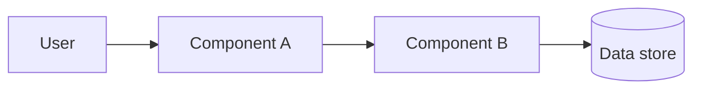

# <Project> architecture

How <project> is built: its parts, how they fit together, and why. For how to set up and develop it, see [development.md](development.md). For what it does, see the spec in [spec/](spec/README.md).

<!-- Replace every <prompt> with the project's real details, and delete any section that does not apply. Where something is not decided yet, say so in the doc instead of leaving a prompt behind. -->

## Overview

<One short paragraph: what the system is made of at the highest level and the main idea behind how it is divided.>

High level overview of the project:

<!-- Replace the example diagram with a Mermaid diagram of the real parts and how they connect. Keep it high level: the major components, the people or systems outside, and the arrows between them. -->

## Components

<One short subsection per major part (an app, a service, a library, a process). For each: what it does, what it owns, and what it must not do.>

### <Component name>

<What it does, what it owns, what it must not do. Where it lives in the repo.>

## How the components talk to each other

<How the parts communicate (function calls, HTTP, messages, files, a shared database) and in which direction. A small diagram in a code block is welcome.>

## Where work runs

<Which part does which kind of work. Name where slow, heavy or blocking work runs and where it must never run. Name any task system, queue or worker pool, and how a caller starts work and gets the result back.>

## Data flow

<Walk one typical request or user action through the system from start to finish, naming each part it touches.>

## Key design decisions

<One bullet per decision: what was chosen, the alternative that was rejected, and why.>

## Constraints

<The rules the design must never break, such as performance rules, supported platforms and security boundaries.>

## Similar products

<One bullet per product that inspired the features or structure, with a link: what this project takes from it and where it differs.>

## Related docs

- [development.md](development.md): how to develop, test and contribute.
- [setup.md](setup.md): how to set up the project and a worktree.
- [spec/README.md](spec/README.md): what the system does, feature by feature.
